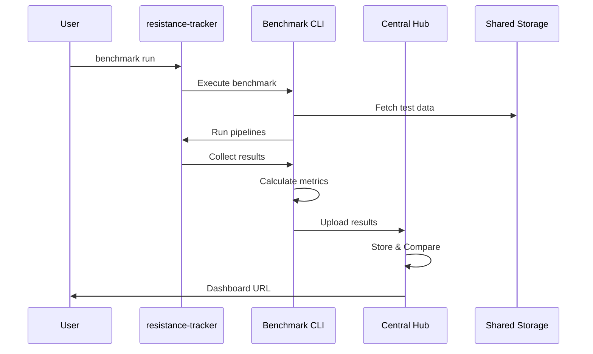

# 크로스-레포지토리 벤치마크 아키텍처 설계

## 1. 핵심 질문 분석

**문제**: 벤치마크 도구(metagenome-pipeline-benchmark)와 실제 분석 프로젝트(resistance-tracker)가 서로 다른 레포지토리인데, 어떻게 효율적으로 벤치마크를 실행하고 관리할 것인가?

## 2. 아키텍처 옵션 비교

### 옵션 A: 중앙집중식 벤치마크 서비스 (권장) ⭐

```
┌─────────────────────────────────────────────────────┐
│          Central Benchmark Service                  │
│    (metagenome-pipeline-benchmark as service)       │
├─────────────────────────────────────────────────────┤
│  • Benchmark Registry                               │
│  • Result Database                                  │  
│  • Comparison Engine                                │
│  • Web Dashboard                                    │
└──────────────┬──────────────────────────────────────┘
               │ API / CLI
    ┌──────────┴──────────┬──────────────┬───────────┐
    ▼                     ▼              ▼           ▼
resistance-tracker    project-B     project-C    project-D
```

### 옵션 B: 라이브러리/SDK 방식

```
metagenome-pipeline-benchmark (as library)
    ↓ pip install / git submodule
    ├── resistance-tracker/
    ├── project-B/
    └── project-C/
        (각 프로젝트가 독립적으로 벤치마크 실행)
```

### 옵션 C: 하이브리드 방식 (최적 균형) ⭐⭐

```
Central Components + Local Execution
    • 중앙: Registry, Dashboard, Comparison
    • 로컬: Execution, Caching
    • 동기화: Result Upload, Metadata Sync
```

## 3. 권장 아키텍처: 하이브리드 벤치마크 시스템

### 3.1 시스템 구성요소

```yaml
# benchmark-system-architecture.yaml
components:
  central_hub:
    location: "metagenome-pipeline-benchmark repo"
    services:
      - benchmark_registry    # 벤치마크 정의 저장소
      - result_warehouse      # 결과 중앙 저장소
      - comparison_engine     # 비교 분석 엔진
      - web_dashboard        # 시각화 대시보드
      - api_server          # REST API 서버
      
  local_agent:
    location: "각 프로젝트 (resistance-tracker 등)"
    components:
      - benchmark_cli        # 벤치마크 실행 CLI
      - local_cache         # 로컬 결과 캐시
      - config_manager      # 프로젝트별 설정
      - result_uploader     # 결과 업로드 모듈
      
  shared_resources:
    location: "공유 스토리지 (NAS/S3)"
    contents:
      - reference_databases  # 공유 DB
      - test_datasets       # 표준 테스트 데이터
      - benchmark_results   # 공유 결과
```

### 3.2 설치 및 통합 방법

#### Step 1: 벤치마크 CLI 도구 설치

```bash
# 방법 1: pip 패키지로 설치 (권장)
pip install metagenome-benchmark-cli

# 방법 2: Git 서브모듈로 추가
cd resistance-tracker
git submodule add https://github.com/org/metagenome-pipeline-benchmark.git benchmark
git submodule update --init --recursive

# 방법 3: Docker 이미지로 사용
docker pull metagenome/benchmark:latest
```

#### Step 2: 프로젝트별 설정 파일

```yaml
# resistance-tracker/.benchmark/config.yaml
benchmark:
  # 프로젝트 메타데이터
  project:
    name: "resistance-tracker"
    type: "amr-detection"
    owner: "team-genomics"
    
  # 중앙 서버 연결
  central_hub:
    url: "https://benchmark.metagenome.org"
    api_key: "${BENCHMARK_API_KEY}"
    auto_upload: true
    
  # 로컬 설정
  local:
    cache_dir: ".benchmark/cache"
    results_dir: ".benchmark/results"
    max_parallel: 4
    
  # 벤치마크 대상
  pipelines:
    - name: "nfcore_mag"
      version: "3.1.0"
      config: "./nextflow.config"
    - name: "nfcore_funcscan"
      version: "1.1.0"
      focus: "amr_genes"
      
  # 평가 기준
  evaluation:
    metrics:
      - amr_sensitivity
      - amr_specificity
      - runtime
      - memory_usage
    priority:
      amr_sensitivity: 0.5
      runtime: 0.3
      memory_usage: 0.2
```

### 3.3 벤치마크 실행 워크플로우

#### 로컬 프로젝트에서 실행

```bash
# resistance-tracker 프로젝트 내에서
cd ~/resistance-tracker

# 1. 벤치마크 초기화
benchmark init --project-type amr-detection

# 2. 자신의 데이터로 벤치마크 실행
benchmark run \
  --input ./data/TARA_samples.csv \
  --pipelines nfcore_mag,nfcore_funcscan \
  --output .benchmark/results/$(date +%Y%m%d)

# 3. 결과 중앙 서버에 업로드 (자동 또는 수동)
benchmark upload --run-id latest

# 4. 다른 프로젝트와 비교
benchmark compare --with project:metasub-analysis
```

#### 중앙 대시보드에서 확인

```python
# src/benchmark_client.py
from metagenome_benchmark import BenchmarkClient

class ResistanceTrackerBenchmark:
    def __init__(self):
        self.client = BenchmarkClient(
            api_key=os.getenv('BENCHMARK_API_KEY'),
            project='resistance-tracker'
        )
    
    def run_benchmark(self, data_path):
        # 벤치마크 실행
        run_id = self.client.start_benchmark(
            input_data=data_path,
            pipelines=['nfcore_mag', 'nfcore_funcscan'],
            metrics=['amr_sensitivity', 'runtime']
        )
        
        # 진행 상황 모니터링
        while not self.client.is_complete(run_id):
            status = self.client.get_status(run_id)
            print(f"Progress: {status.progress}%")
            time.sleep(60)
        
        # 결과 가져오기
        results = self.client.get_results(run_id)
        
        # 최적 파이프라인 추천받기
        recommendation = self.client.get_recommendation(
            results=results,
            constraints={'max_runtime': '24h', 'min_sensitivity': 0.9}
        )
        
        return recommendation
```

## 4. 데이터 흐름 및 관리

### 4.1 벤치마크 실행 흐름



### 4.2 결과 관리 구조

```bash
# 로컬 프로젝트 (resistance-tracker)
resistance-tracker/
├── .benchmark/
│   ├── config.yaml                    # 프로젝트 설정
│   ├── cache/                         # 로컬 캐시
│   └── results/
│       ├── 20240119_run1/            # 로컬 실행 결과
│       │   ├── metadata.json
│       │   ├── metrics.json
│       │   └── logs/
│       └── comparisons/               # 비교 분석 결과

# 중앙 저장소 (metagenome-pipeline-benchmark)
benchmark-central/
├── registry/
│   ├── projects/
│   │   ├── resistance-tracker/       # 프로젝트별 히스토리
│   │   ├── metasub-analysis/
│   │   └── soil-microbiome/
│   └── benchmarks/
│       ├── amr-detection/             # 벤치마크 타입별
│       ├── diversity-analysis/
│       └── assembly-quality/
├── warehouse/
│   ├── results/                      # 모든 결과 통합
│   │   └── {project_id}/{run_id}/
│   └── aggregated/                   # 집계 데이터
│       ├── by_pipeline/
│       ├── by_dataset/
│       └── by_metric/
└── dashboard/
    └── public/                        # 웹 대시보드
```

## 5. 실제 통합 시나리오

### 5.1 신규 프로젝트 온보딩

```bash
#!/bin/bash
# scripts/onboard_new_project.sh

PROJECT_NAME="new-metagenome-project"
PROJECT_TYPE="pathogen-detection"

# 1. 벤치마크 도구 설치
pip install metagenome-benchmark-cli

# 2. 프로젝트 등록
benchmark register \
  --name $PROJECT_NAME \
  --type $PROJECT_TYPE \
  --github "https://github.com/org/$PROJECT_NAME"

# 3. 초기 설정 생성
benchmark init \
  --template $PROJECT_TYPE \
  --output .benchmark/config.yaml

# 4. 테스트 실행
benchmark test --quick

# 5. 대시보드 접근 토큰 받기
benchmark auth --get-token
```

### 5.2 CI/CD 파이프라인 통합

```yaml
# .github/workflows/benchmark.yml
name: Automated Benchmark

on:
  pull_request:
    paths:
      - 'pipelines/**'
      - 'configs/**'
  schedule:
    - cron: '0 0 * * 0'  # 주간 실행

jobs:
  benchmark:
    runs-on: ubuntu-latest
    steps:
      - uses: actions/checkout@v3
      
      - name: Setup Benchmark CLI
        run: |
          pip install metagenome-benchmark-cli
          benchmark auth --token ${{ secrets.BENCHMARK_TOKEN }}
      
      - name: Run Benchmark
        run: |
          benchmark run \
            --config .benchmark/config.yaml \
            --mode ci \
            --compare-with main
      
      - name: Comment PR with Results
        if: github.event_name == 'pull_request'
        run: |
          benchmark report \
            --format markdown \
            --output benchmark_report.md
          gh pr comment --body-file benchmark_report.md
      
      - name: Upload to Central Hub
        run: |
          benchmark upload \
            --tag "ci-run" \
            --branch ${{ github.ref }}
```

## 6. API 및 SDK 설계

### 6.1 Python SDK

```python
# metagenome_benchmark/sdk.py
class BenchmarkSDK:
    """프로젝트에서 직접 사용할 수 있는 SDK"""
    
    def __init__(self, project_config='.benchmark/config.yaml'):
        self.config = self.load_config(project_config)
        self.client = CentralHubClient(self.config.central_hub)
        
    def quick_benchmark(self, data_path, pipelines=None):
        """간단한 벤치마크 실행"""
        pipelines = pipelines or self.config.pipelines
        
        results = {}
        for pipeline in pipelines:
            result = self.run_pipeline(pipeline, data_path)
            metrics = self.evaluate_metrics(result)
            results[pipeline.name] = metrics
            
        # 자동 업로드 (설정된 경우)
        if self.config.auto_upload:
            self.client.upload_results(results)
            
        return results
    
    def compare_with_community(self, my_results):
        """커뮤니티 평균과 비교"""
        community_stats = self.client.get_community_stats(
            project_type=self.config.project.type
        )
        
        comparison = {
            'my_rank': self.calculate_rank(my_results, community_stats),
            'percentile': self.calculate_percentile(my_results, community_stats),
            'recommendations': self.get_recommendations(my_results, community_stats)
        }
        
        return comparison
    
    def get_optimal_pipeline(self, constraints):
        """제약 조건에 맞는 최적 파이프라인 추천"""
        return self.client.recommend_pipeline(
            project_type=self.config.project.type,
            constraints=constraints
        )
```

### 6.2 REST API

```python
# api/endpoints.py
from fastapi import FastAPI, HTTPException
from typing import Optional

app = FastAPI(title="Metagenome Benchmark API")

@app.post("/api/v1/benchmark/run")
async def run_benchmark(
    project_id: str,
    input_data: str,
    pipelines: list[str],
    async_mode: bool = True
):
    """벤치마크 실행 요청"""
    run_id = start_benchmark_job(
        project_id=project_id,
        input_data=input_data,
        pipelines=pipelines
    )
    
    if async_mode:
        return {"run_id": run_id, "status": "queued"}
    else:
        result = await wait_for_completion(run_id)
        return {"run_id": run_id, "results": result}

@app.get("/api/v1/benchmark/status/{run_id}")
async def get_status(run_id: str):
    """벤치마크 진행 상황 조회"""
    status = get_job_status(run_id)
    return {
        "run_id": run_id,
        "status": status.state,
        "progress": status.progress,
        "eta": status.estimated_completion
    }

@app.get("/api/v1/benchmark/compare")
async def compare_projects(
    project_a: str,
    project_b: str,
    metric: Optional[str] = None
):
    """프로젝트 간 벤치마크 결과 비교"""
    comparison = compare_benchmark_results(
        project_a=project_a,
        project_b=project_b,
        metric=metric
    )
    return comparison

@app.get("/api/v1/leaderboard/{category}")
async def get_leaderboard(
    category: str,
    limit: int = 10
):
    """카테고리별 리더보드"""
    leaders = get_top_performers(
        category=category,
        limit=limit
    )
    return {"category": category, "leaders": leaders}
```

## 7. 모니터링 및 거버넌스

### 7.1 중앙 대시보드

```typescript
// dashboard/src/components/ProjectDashboard.tsx
interface ProjectDashboard {
  projectId: string;
  
  sections: {
    overview: {
      totalRuns: number;
      bestPipeline: string;
      avgPerformance: MetricSet;
      trend: TimeSeriesData;
    };
    
    comparison: {
      vsBaseline: ComparisonResult;
      vsCommunity: CommunityRank;
      vsHistory: HistoricalTrend;
    };
    
    recommendations: {
      nextSteps: string[];
      optimizations: PipelineConfig[];
      costSavings: CostAnalysis;
    };
  };
}
```

### 7.2 데이터 거버넌스

```yaml
# governance/data-policy.yaml
data_governance:
  ownership:
    - project_results: "프로젝트 소유자"
    - aggregated_stats: "커뮤니티 공유"
    - benchmark_definitions: "중앙 관리팀"
    
  privacy:
    default_visibility: "project-only"
    sharing_options:
      - private: "프로젝트 내부만"
      - community: "익명화 후 공유"
      - public: "전체 공개"
      
  retention:
    raw_results: "90 days"
    aggregated_results: "1 year"
    archived_results: "indefinite"
    
  compliance:
    gdpr: true
    data_anonymization: true
    audit_logging: true
```

## 8. 실무 예시: resistance-tracker 적용

### 8.1 초기 설정

```bash
# resistance-tracker 프로젝트에서
cd ~/resistance-tracker

# 1. 벤치마크 도구 설치
pip install metagenome-benchmark-cli

# 2. 프로젝트 초기화
benchmark init \
  --project-name "resistance-tracker" \
  --project-type "amr-detection" \
  --central-hub "https://benchmark.metagenome.org"

# 3. 설정 커스터마이징
cat > .benchmark/config.yaml << EOF
benchmark:
  project:
    name: "resistance-tracker"
    focus: "antibiotic-resistance"
  pipelines:
    - nfcore_mag:
        version: "3.1.0"
        params:
          min_contig_size: [1500, 2500]
    - nfcore_funcscan:
        version: "1.1.0"
        databases: ["card", "resfinder"]
  evaluation:
    primary_metric: "amr_gene_recall"
    constraints:
      max_runtime: "24h"
      min_sensitivity: 0.85
EOF
```

### 8.2 벤치마크 실행 및 분석

```python
# resistance-tracker/scripts/run_benchmark.py
from metagenome_benchmark import BenchmarkSDK
import pandas as pd

def main():
    # SDK 초기화
    benchmark = BenchmarkSDK(project_config='.benchmark/config.yaml')
    
    # 1. 로컬 데이터로 벤치마크
    local_results = benchmark.quick_benchmark(
        data_path='./data/TARA_samples.csv',
        pipelines=['nfcore_mag', 'nfcore_funcscan']
    )
    
    # 2. 커뮤니티와 비교
    comparison = benchmark.compare_with_community(local_results)
    print(f"Your rank: {comparison['my_rank']}")
    print(f"Percentile: {comparison['percentile']}%")
    
    # 3. 최적 설정 추천받기
    optimal = benchmark.get_optimal_pipeline(
        constraints={
            'data_type': 'metagenome',
            'focus': 'amr_genes',
            'max_memory': '150GB'
        }
    )
    
    print(f"Recommended: {optimal['pipeline']}")
    print(f"Expected performance: {optimal['expected_metrics']}")
    
    # 4. 결과 저장 및 리포트 생성
    benchmark.generate_report(
        results=local_results,
        comparison=comparison,
        output='benchmark_report.html'
    )
    
    # 5. 중앙 대시보드 URL 받기
    dashboard_url = benchmark.get_dashboard_url()
    print(f"View results at: {dashboard_url}")

if __name__ == "__main__":
    main()
```

## 9. 장단점 분석 및 권장사항

### 9.1 하이브리드 방식의 장점
- ✅ **유연성**: 각 프로젝트가 독립적으로 실행
- ✅ **확장성**: 새 프로젝트 쉽게 추가
- ✅ **비교 가능**: 중앙에서 통합 비교
- ✅ **버전 관리**: 벤치마크 도구 버전 독립적 관리

### 9.2 구현 시 주의사항
- ⚠️ API 키 관리 및 보안
- ⚠️ 네트워크 의존성 (오프라인 모드 필요)
- ⚠️ 데이터 프라이버시 정책 수립

### 9.3 최종 권장사항

**Phase 1 (MVP - 1개월)**
- 로컬 CLI 도구 개발
- 기본 메트릭 수집
- 로컬 결과 저장

**Phase 2 (통합 - 2개월)**
- 중앙 API 서버 구축
- 결과 업로드/다운로드
- 웹 대시보드 기본 구현

**Phase 3 (고도화 - 2개월)**
- 커뮤니티 기능
- 자동 추천 시스템
- CI/CD 통합

## 10. 결론

가장 효율적인 방법은 **하이브리드 아키텍처**입니다:

1. **로컬 실행**: 각 프로젝트에서 독립적으로 벤치마크 실행
2. **중앙 관리**: 결과는 중앙 서버에 선택적 업로드
3. **공유 인텔리전스**: 커뮤니티 벤치마크 데이터로 최적화 추천

이렇게 하면 resistance-tracker 같은 개별 프로젝트도 자유롭게 벤치마크를 실행하면서, 동시에 전체 커뮤니티의 집단 지성을 활용할 수 있습니다.